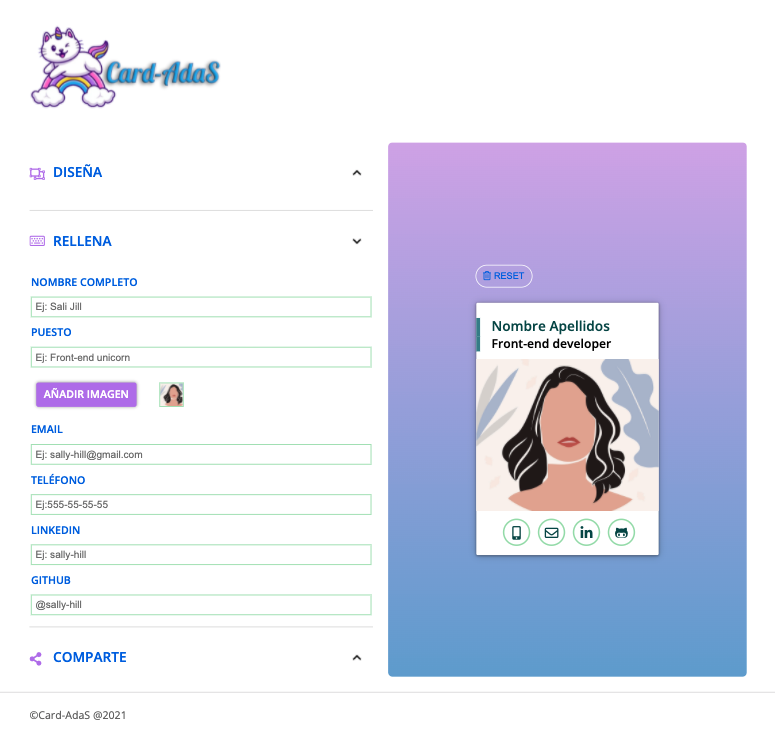

# Refactorización de código heredado y desarrollo de servidor web.

Este proyecto grupal consiste en refactorizar un código heredado, generar los componentes necesarios usando React, implementar la comunicación con el backend y usar Scrum como marco de referencia de trabajo.

Esta es la apariencia de la web:

### Tecnologías y recursos utilizados para el proyecto:

- HTML y preprocesador SASS con sintaxis SCSS
- Markdown
- Gulp
- Javascript
- React
- Node JS
- Express JS
- SQL
- API Rest
